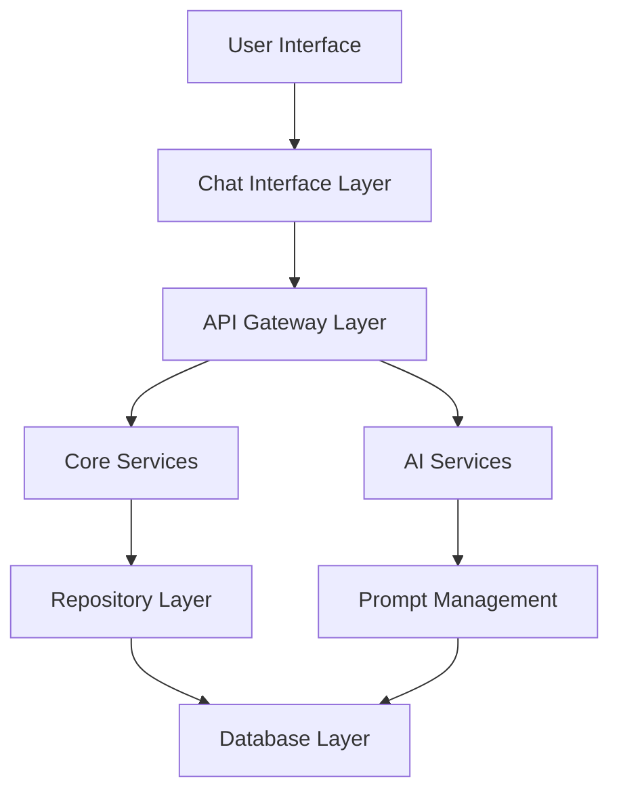

# CodeForegX Master Architecture & Status Diagram

## 🗺️ System Architecture Overview

---

## 🧩 Core Module Map & Status

| Module/Component                | Status      | Notes |
|---------------------------------|-------------|-------|
| Chat Interface                  | ✅ Complete | Modern UI, Markdown, context mgmt |
| Code Generation (MT5/MQL5)      | ✅ Complete | EA/blueprint, MQL5-compliant      |
| Blueprint Generation            | ✅ Complete | Phase logic, context, review      |
| **Orchestration & Phase Transition Logic** | ⏳ In Progress | **TOP PRIORITY: Backend, Frontend, Prompt Engineering** |
| Admin Dashboard                 | ⏳ In Progress | Basic structure, analytics planned |
| Prompt Management System        | ⏳ In Progress | External templates, versioning   |
| Token Management System         | ⏳ In Progress | JWT, basic roles, more planned   |
| Document Fingerprinting System  | ⏳ In Progress | Vector search, doc crawler planned|
| QuickFix Engine                 | ⏳ In Progress | Code validation, auto-fix planned|
| Vector Database System          | ⏳ In Progress | Milvus/Redis planned             |
| Authentication & User System    | ✅ Complete | JWT, RBAC, session mgmt          |
| AI Integration System           | ✅ Complete | Claude 3.7 Sonnet, context, error handling |
| Technical Support System        | ⏳ In Progress | Knowledge base, chat support    |
| Data Repository System          | ✅ Complete | MongoDB, project/session models   |

---

## 🔄 Workflow Status

- **🚨🚨🚨 REMINDER: THE NEXT STEP IS TO IMPLEMENT ORCHESTRATION & PHASE TRANSITION LOGIC (BACKEND + FRONTEND + PROMPT ENGINEERING) AS THE TOP PRIORITY. DO NOT PROCEED TO OTHER FEATURES UNTIL THIS IS COMPLETE. 🚨🚨🚨**

- **Project Creation Workflow:**  
  Requirements Chat → Intent Detection → Blueprint Generation → Blueprint Review → Component Generation → Testing → Deployment  
  **Status:** 80%+ Complete (Orchestration/Phase Transition Logic is the main blocker; Testing/Deployment UI pending)

- **Admin Management Workflow:**  
  User Management → Token Configuration → Prompt Template Editing (phase-specific prompts) → Document Crawler Setup → System Monitoring  
  **Status:** In Progress

- **Documentation Integration Workflow:**  
  Document Crawling → Validation → Embedding Generation → Vector Storage → Search Integration → AI Context Enhancement  
  **Status:** Planned/In Progress

---

## 📊 Visual Progress Summary

- **Completed:** Chat, Code/Blueprint Gen, Auth, AI Integration, Data Repo
- **In Progress:** Orchestration/Phase Transition, Admin, Prompt Mgmt, Token Mgmt, Doc Fingerprinting, QuickFix, Vector DB, Tech Support
- **Planned:** Advanced analytics, mobile, marketplace, real-time collab

---

**Legend:**
- ✅ Complete
- ⏳ In Progress
- Planned

_Last updated: {{DATE}}_ 